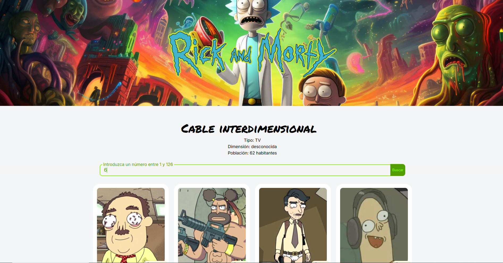

<!-- PROJECT LOGO -->

  

  <h3 align="center">RICK AND MORTY| A MODERN APP</h3>
  
Welcome to the Rick and Morty App! 🚀🛸 Dive into the chaotic and fun universe of "Rick and Morty" with this interactive app that lets you explore characters, episodes, and more. Powered by React, the Rick and Morty App offers a friendly, dynamic interface so fans of the series can access detailed information about their favorite characters and the adventures they experience.
     
    <a href="https://sth-rickandmorty.netlify.app/"><strong>Demo »</strong></a>
     
  

  

# Versión App
- **Versión:** 1.0
- **Fecha (UTC):** 2025-02-08 22:45:57

# RickAndMortyApi

[[Api utilizada](https://jesus-fernandez.notion.site/Entregable-3-Rick-and-Morty-App-124339baf02880b4b2d8da84bda9e377?pvs=25)]

# Tecnologías

1.  **React**
1.  [[**Axios**]](https://axios-http.com/es/)
2.  [[**React-Router**]](https://reactrouter.com/)]
3.  [[**Zustand**]](https://zustand-demo.pmnd.rs/)
4.  **JavaScript**
5.  **Css**

